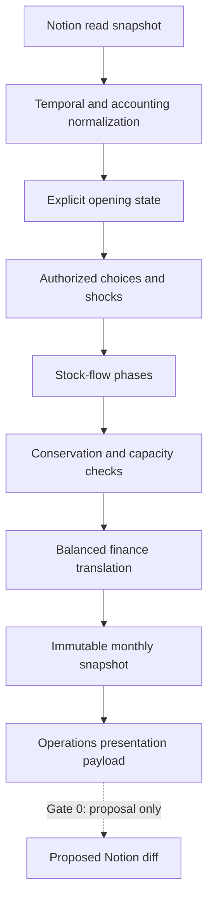

# Architecture — Gate 0/1 Contract

## Pipeline

## Shared identifiers

IDs are stable lowercase slugs scoped by domain (`entity:`, `site:`, `commodity:`,
`route:`, `recipe:`, `event:`). Display names remain mutable presentation data.
External Notion URLs and source locators are retained separately.

## Numeric rules

All quantities, prices, amounts, rates, and percentages use `Decimal`. Units are
explicit strings. Conversion requires a named conversion rule; the engine never
adds unlike units. A route carries one declared commodity, so its capacity and
loss rate cannot silently combine different units.

## Agriculture planning lane

`agriculture_source` validates the read-only 26-authority fixture and produces
typed, provenance-bound Decimal values. `agriculture_calendar` keeps the Day 7
Hammer 1495 live freeze separate from forward, later, technical, projected, and
undated material. `agriculture_production`, `agriculture_simulation`, and
`agriculture_logistics` are pure planning calculators: they cannot advance time,
post finance, or write Notion. `agriculture_report` embeds the reviewed source
pack and browser-only assumption calculators into one self-contained HTML file.

The old regional adapter is not upstream of this lane. Its synthetic recipes,
opening stocks, prices, routes, banking, and tax rules cannot leak into the
campaign-facing workbench.

## Monthly phase order

1. Load and validate the accepted parent snapshot.
2. Apply arrivals and previously resolved dated events.
3. Allocate available labour and execute feasible recipes.
4. Dispatch authorized shipments within stock and route capacity.
5. Satisfy prioritized local needs from available inventory.
6. Record shortages, spoilage, and route losses.
7. Recompute bounded local prices from realized coverage.
8. Translate resolved monetary consequences into balanced postings.
9. Validate conservation, capacities, accounting, and replay hash.
10. Seal a new immutable snapshot and generate presentation data.

Actual-state mutations require a current, resolved, authoritative event already
accepted by the append-only event store. The new snapshot binds the parent,
ruleset, model, run plan, and full event-envelope hashes; changing provenance,
authority, payload, or any other semantic field fails replay rather than silently
producing a different history. Every actual genesis—including an empty opening—
requires one complete, payload-matched `stock.opening` source-lock event.

Existing sector rolls and complications enter as resolved events or bounded shocks;
they do not directly multiply every entity's revenue without a material cause.

## Registry business sidecar

Gate 1 keeps one-row Registry business previews in a separate SQLite store rather
than changing the Operation Laden campaign-store schema. A verified offline
export is sealed as one semantic snapshot plus 90 typed rows. A business run binds
the exact export, snapshot, row, consumed properties, option receipt, dice faces,
result, and artifacts into an append-only bundle. Database triggers reject update,
delete, replacement conflicts, and late artifact insertion; open, append, and
verification compare the exact reviewed table/trigger SQL rather than trusting
object names and require foreign keys plus recursive triggers. Duplicate-insert
guards also reject `INSERT OR REPLACE` from an external default SQLite connection.
Verification replays every source and content hash and runs SQLite integrity and
foreign-key checks.

The business result is a scenario assumption. Its financial result can populate a
human-reviewable diff, but the accompanying ledger preview always has zero
transactions/postings and the Notion diff is always non-executable. The fixed
positive banking sandbox is a separate output-only proposal and cannot enter the
actual journal.

The Brickworks capacity profile is intentionally not a stock-flow recipe. Its
source supplies two capacity statements but not the conversion ratio or opening
inventory required to demonstrate material conservation.

## Ring 1 boundary

The runnable regional adapter currently seals one complete preview month. Within
that close, production precedes the scenario's monthly storage loss, explicit
zero-period handling links deliver and settle locally, and stock-flow routes with
positive travel time dispatch into transit. Demand then consumes on-hand stock,
site-local prices respond, delivered trades become balanced sidecar transactions,
and finance actions are calculated from realized receipts/outflows. Pending
transit is preserved in the market snapshot but is not yet reopened for period
two; the CLI fails closed instead of dropping or prematurely settling it.

Initial sites: Neverwinter, Longsaddle, Dawnwood, and explicitly sourced connecting
nodes. Initial commodity families should remain small: staple food, fodder, timber,
stone, iron, tools, construction materials, fuel, salt/preserved food, and one
generic luxury/magical-input band where source detail is insufficient.

Households, individual merchants, autonomous agent cognition, every craft subtype,
continental equilibrium, and planar markets are outside the MVP.
